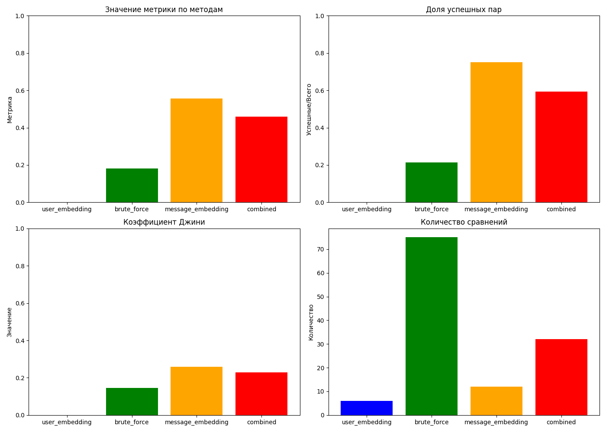

# Исследование алгоритмов рекомендации для GPTinder

## Обзор

В рамках проекта GPTinder было проведено исследование четырех различных алгоритмов рекомендации, которые позволяют находить потенциально полезные пары пользователей на основе их сообщений AI-ассистенту. 

## Методы

1. **Brute Force (Полный перебор)** — сравнение всех сообщений со всеми
2. **User Embedding (Эмбеддинги пользователей)** — фильтрация по похожим пользователям
3. **Message Embedding (Эмбеддинги сообщений)** — сравнение по близости сообщений
4. **Combined (Комбинированный подход)** — двухэтапная фильтрация

## Ключевые результаты

| Метод | Сравнений | Успешных пар | Джини | Метрика |
|-------|-----------|--------------|-------|---------|
| User Embedding | 6 | 0 | 0.0000 | 0.0000 |
| Brute Force | 75 | 16 | 0.1458 | 0.1822 |
| Message Embedding | 12 | 9 | 0.2593 | 0.5556 |
| Combined | 32 | 19 | 0.2281 | 0.4583 |

## Выводы

1. **Наиболее эффективный метод**: на основе эмбеддингов сообщений (лучшая метрика: 0.5556)
2. **Наиболее успешный метод**: комбинированный подход (больше всего успешных пар: 19)
3. **Наименее эффективный**: метод полного перебора (худшая метрика при большом числе сравнений)

## Рекомендации

Для дальнейшего развития системы рекомендуется использовать **комбинированный подход**, который обеспечивает хороший баланс между точностью и вычислительной сложностью, особенно при масштабировании.

## Дополнительные материалы

* [Полный отчет об исследовании](data/results/research_report.md)
* [Исходный код для анализа](analyze_data.py)
* [Подробные результаты по каждому методу](data/results/) 